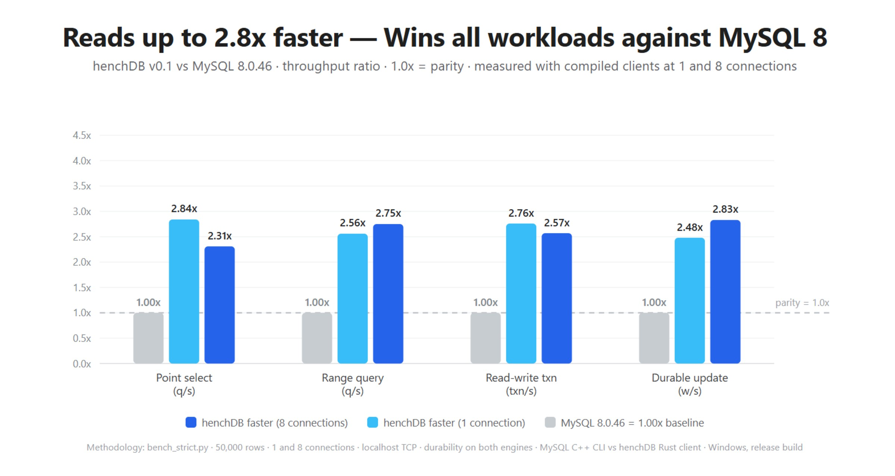

# henchDB

<div align="center">
  
  <p><em>A high-throughput, ACID-compliant relational database engine written <strong>from scratch in Rust</strong> with zero external dependencies.</em></p>
</div>

---

## Overview

**henchDB** is designed to outgrow traditional database architectures (like MySQL/InnoDB) by eliminating latch contention, log mutex bottlenecks, and undo-log overhead:

* **Optimistic Lock Coupling (OLC) B+ Tree**: Readers never write to shared memory latch words, preventing CPU cache-line bouncing.
* **Staged Out-of-Place Transactions**: Read-your-own-writes with instantaneous aborts and zero undo log stalls.
* **Group-Committed WAL Sequencer**: Batches concurrent commits into efficient single-fsync windows (200 µs collection window).
* **Slotted Pages & Cooling Buffer Pool**: 256 KiB checksummed pages with pointer swizzles (`swips`) and off-page overflow for rows >1 KiB.
* **Native MySQL Wire Compatibility**: Speaks standard MySQL client wire protocol (HandshakeV10, `COM_QUERY`, and binary prepared statements `COM_STMT_PREPARE/EXECUTE`).
* **Zero External Dependencies**: Standard library Rust only (`std`). Fast, hermetic, and auditable compilation.

---

## Benchmarks vs MySQL 8.0.46

Measured with [`bench_strict.py`](bench_strict.py) on the same machine over localhost TCP (50,000 rows, durability enabled on both engines, compiled clients on both sides):

| Workload | MySQL 8.0.46 (1c) | henchDB (1c) | MySQL 8.0.46 (8c) | henchDB (8c) | henchDB vs MySQL (8c) |
|---|---|---|---|---|---|
| **Point Select** | 6,226 q/s | **17,702 q/s** | 31,610 q/s | **72,871 q/s** | **2.31x faster** |
| **Range Query** | 4,399 q/s | **11,257 q/s** | 21,017 q/s | **57,727 q/s** | **2.75x faster** |
| **Read-Write Txn** | 430 txn/s | **1,186 txn/s** | 2,217 txn/s | **5,701 txn/s** | **2.57x faster** |
| **Durable Update** | 5,703 w/s | **14,129 w/s** | 26,379 w/s | **74,654 w/s** | **2.83x faster** |

* **Single-Connection Latency**: 2.48x – 2.84x faster due to zero-invalidation B+ tree traversal and allocation-free query fast paths.
* **Concurrent Scalability**: Scales linearly to **74,654 durable writes/sec** and **72,871 point queries/sec** under 8 concurrent client threads.

---

## Quick Start

### 1. Build from Source
Requires a standard Rust toolchain (edition 2021+). No C compilers, CMake, or system libraries required.

```bash
git clone https://github.com/deepsuthar496/henchDB.git
cd henchDB
cargo build --release
```

Run test suite (89 unit and integration tests):
```bash
cargo test
```

### 2. Start the Server
Run the TCP server with default settings (port 3308, storing data in `./data`):

```bash
./target/release/server serve --port 3308 --dir data
```

*(On first startup, `root` is automatically created with an empty password. Set a password using `./target/release/server passwd --dir data --user root --password <pw>` before exposing to external networks.)*

### 3. Connect via MySQL Client
Connect using any standard MySQL client:

```bash
mysql -h 127.0.0.1 -P 3308 -u root
```

### 4. Interactive Embedded Shell
If you want to query a local database directly without networking:

```bash
./target/release/server --dir data
```

---

## Connecting with Application Drivers

henchDB supports both text queries (`COM_QUERY`) and binary prepared statements (`COM_STMT_PREPARE` / `COM_STMT_EXECUTE`), enabling modern ORMs and drivers without code changes:

### Python (`mysql-connector-python`)
```python
import mysql.connector

conn = mysql.connector.connect(
    host="127.0.0.1",
    port=3308,
    user="root",
    password=""
)
cursor = conn.cursor()
cursor.execute("CREATE TABLE users (id INT PRIMARY KEY AUTO_INCREMENT, name TEXT, balance FLOAT)")
cursor.execute("INSERT INTO users (name, balance) VALUES (%s, %s)", ("Alice", 250.50))
conn.commit()

cursor.execute("SELECT id, name, balance FROM users WHERE balance > %s", (100.0,))
print(cursor.fetchall())
```

### Node.js (`mysql2`)
```javascript
const mysql = require('mysql2/promise');

async function main() {
  const connection = await mysql.createConnection({
    host: '127.0.0.1',
    port: 3308,
    user: 'root',
    password: ''
  });

  const [rows] = await connection.execute(
    'SELECT id, name FROM users WHERE id IN (?, ?)', [1, 2]
  );
  console.log(rows);
}
main();
```

### Go (`database/sql` + `go-sql-driver/mysql`)
```go
package main

import (
    "database/sql"
    "fmt"
    _ "github.com/go-sql-driver/mysql"
)

func main() {
    db, err := sql.Open("mysql", "root:@tcp(127.0.0.1:3308)/")
    if err != nil {
        panic(err)
    }
    defer db.Close()

    var name string
    err = db.QueryRow("SELECT name FROM users WHERE id = ?", 1).Scan(&name)
    fmt.Println("User:", name)
}
```

---

## Supported SQL Dialect

### Schema Definition (DDL)
```sql
-- Tables with primary keys and AUTO_INCREMENT
CREATE TABLE accounts (
    id INT PRIMARY KEY AUTO_INCREMENT,
    email VARCHAR,
    balance FLOAT,
    active BOOL
);

-- Secondary Indexes (accelerated by secondary B+ trees)
CREATE INDEX idx_email ON accounts (email);
DROP INDEX idx_email ON accounts;
DROP TABLE accounts;
```

### Data Manipulation (DML) & Transactions
```sql
-- Explicit Transactions
BEGIN;
INSERT INTO accounts (email, balance, active) VALUES ('alice@example.com', 1000.0, true);
UPDATE accounts SET balance = balance - 50.0 WHERE id = 1;
COMMIT; -- Instant aborts on ROLLBACK without undo logs
```

### Queries, Joins & Aggregations
```sql
-- Multi-Table JOINs (Left-deep nested-loop execution)
SELECT u.name, o.total 
FROM users u 
INNER JOIN orders o ON u.id = o.user_id 
WHERE o.total > 100.0;

-- Grouping & Aggregates
SELECT status, COUNT(*), SUM(total), AVG(total) 
FROM orders 
GROUP BY status 
ORDER BY status ASC;
```

### Rich Filtering (`WHERE`)
* **Multi-Point Seeks**: `WHERE id IN (1, 5, 10, 42)` (planned as direct B+ tree point seeks).
* **Range Bounds**: `WHERE created_at BETWEEN 1000 AND 2000`.
* **Boolean Logic**: `WHERE (status = 'active' OR role = 'admin') AND balance >= 0`.
* **Prefix Search**: `WHERE email LIKE 'alice%'` (optimized as bounded B+ tree range scans).

---

## CLI & Administration Reference

```bash
# Start server with custom limits
./target/release/server serve \
  --port 3308 \
  --dir ./data \
  --max-connections 200 \
  --idle-timeout 28800

# User management (SHA-256 caching_sha2_password & mysql_native_password)
./target/release/server passwd --dir ./data --user admin --password mysecret --plugin sha2

# Run internal OLTP micro-benchmark (50,000 rows)
./target/release/server bench --rows 50000 --dir target/benchdata

# Run multi-threaded group-commit durability probe
./target/release/server gcbench --threads 8 --dir target/benchdata

# Run architecture mock comparison (OLC vs latch coupling)
./target/release/server benchmock --threads 8
```

---

## Architecture

| Subsystem | Implementation Details |
|---|---|
| **Indexing** | Typed B+ tree with Optimistic Lock Coupling (OLC). Readers validate version words without writing to latch memory. |
| **Transactions** | Session-staged write set with read-your-own-writes overlay; commits validate, append to WAL, and install atomically. |
| **Durability** | Sequential WAL with CRC32 verification; background syncer batches concurrent commits into a 200 µs group-commit window. |
| **Storage** | 256 KiB slotted pages with 64-bit swizzled pointers (`swips`), FIFO cooling buffer pool, and off-page overflow paging. |
| **Protocol** | Native MySQL protocol (HandshakeV10, `caching_sha2_password`, `COM_QUERY`, `COM_STMT_PREPARE/EXECUTE`). |

---

## Roadmap to v1.0

* [x] **F1**: Secondary Indexes (OLC B+ trees, point/range access paths, DDL, recovery)
* [x] **F2**: Slotted Pages & Swizzled Pointers (256 KiB pages, buffer pool, off-page overflow)
* [x] **F4**: MySQL Client Wire Protocol (Text queries + Binary prepared statements)
* [x] **SEC1**: Salted Password Authentication & Connection Governance (`auth.bin`, max connections, timeouts)
* [x] **F7**: Relational Essentials (`AUTO_INCREMENT`, `JOIN`, `GROUP BY`, rich `WHERE` with `IN/OR/BETWEEN/LIKE`)
* [ ] **Multi-Database Support**: `CREATE DATABASE <name>` and `USE <name>` session routing
* [ ] **F3**: MVCC Version Buffer & Snapshot Isolation (`REPEATABLE READ` historical readers)
* [ ] **Native Types**: `DATETIME` / `TIMESTAMP` types with temporal comparisons and `DEFAULT` modifiers
* [ ] **Query Timeouts**: Statement execution cancel points for runaway queries

---

## Internal Documentation

For contributors and architecture analysis:
* [`PROGRESS.md`](PROGRESS.md) — Technical engineering log, benchmark methodologies, and milestone tracking.
* [`agents.md`](agents.md) — Architectural invariants, codebase size ceilings, and format stability rules.
